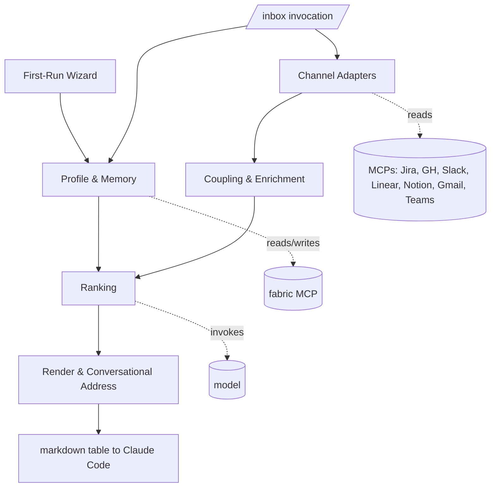

# BOUNDARIES — /inbox (anthara-ai-plugin)

> Derived from discovery brief `docs/specs/inbox-discovery.md`. Bounded contexts and their relationships for the `/inbox` Claude Code skill.

## Modules

### Channel Adapters

- **Owns:** the per-channel manifest format, the MCP-tool-call layer for each connected channel (Jira, GitHub, Slack, Linear, Notion, Gmail, Teams), and the normalization of raw MCP responses into the `Work item` schema.
- **Knows about:** the `Work item` shape (defined in Type Ontology). Does NOT know about Profile, Ranking, or Render.
- **Anti-corruption layer required at:** the boundary between raw MCP responses and the normalized `Work item`. Each adapter is responsible for its own translation; nothing in another module touches a raw MCP payload.

### Profile & Memory

- **Owns:** the fabric prefix-tag conventions for `/inbox` (`[INBOX-PROFILE anthara-ai-plugin ...]`, `[INBOX-LEARNED anthara-ai-plugin ...]`), the first-run wizard, the read/write contract against fabric MCP, and the policy for "when does the model write a learned fact" (currently conservative — explicit teaching only).
- **Knows about:** fabric MCP. Does NOT know about Channel Adapters, Ranking, or Render.
- **Anti-corruption layer required at:** the fabric MCP boundary — all `[INBOX-...]` reads and writes go through this module. No other module talks to fabric directly for `/inbox` concerns.

### Coupling & Enrichment

- **Owns:** the cross-source coupling algorithm (string-match on IDs, URL extraction, fuzzy linking by author+window) and the enrichment step that adds derived features (linked_items, your_relationship, age_buckets, etc.) to the `Work item` set.
- **Knows about:** the `Work item` schema and the collection of items returned by Channel Adapters. Does NOT know about Profile, Ranking, or Render.
- **Anti-corruption layer required at:** the input boundary — accepts only normalized `Work item` lists from Channel Adapters; produces an enriched-and-coupled `Work item` list for Ranking.

### Ranking

- **Owns:** the model prompt that takes (Profile, Hint, Memory-derived facts, Enriched `Work item` list) and returns a ranked top-N table with `Why now` annotations. Owns the prompt template, the model invocation, and the parsing of the model's structured response.
- **Knows about:** Profile + Memory (for the role and learned facts), Coupling's output (the enriched item set), and the rendered output's shape (so the model knows what columns to fill).
- **Anti-corruption layer required at:** the model boundary — all model calls happen here; no other module invokes a model.

### Render & Conversational Address

- **Owns:** the markdown table rendering, the column widths / truncation rules, and the convention that subsequent chat turns can address rows by their number. The "let's work on #3" resolution happens here (or is delegated back to the host conversation context — see note below).
- **Knows about:** the Ranking module's output shape.
- **Anti-corruption layer required at:** the terminal-output boundary — all rendering decisions live here.

> Note: row-address resolution is not a module of `/inbox` per se — the Claude Code session's natural conversation context handles it. Render's job is to produce a markdown table that the host can reference back to in subsequent turns. This is the "subtraction-as-design" choice from the discovery brief (Finding 5.3.3).

## Dependency direction

Direction rules:

- Channel Adapters are *upstream* of everything except Profile & Memory and the Invocation entry point.
- Profile & Memory is *upstream* of Ranking and Render (Render may use Profile for time-zone-aware "age" formatting).
- Coupling sits between Channel Adapters and Ranking; it is the only module that sees the full cross-channel item set before ranking.
- Ranking is the only module that invokes a model.
- Render is *downstream* of everything; it never reads back from Profile, Channel Adapters, or Coupling.

## Forbidden patterns

- **Cross-context imports without an anti-corruption layer.** Ranking must not poke into a raw Jira payload; Channel Adapters must not write to fabric; Render must not invoke a model.
- **Direct fabric reads/writes outside the Profile & Memory module.** All `[INBOX-...]` reads and writes flow through that module so the prefix discipline is enforced in one place.
- **Direct MCP calls outside Channel Adapters.** If Ranking ever needs to enrich an item with another MCP call (e.g., fetch a Jira ticket's parent), it goes through a Channel Adapter, not directly to the MCP.
- **Hardcoded per-channel logic outside the channel's manifest + adapter.** Adding a channel must mean adding a manifest + a thin adapter that converts raw MCP output into the normalized `Work item` shape — not editing Ranking, Coupling, or Render to special-case the new channel.
- **Model invocations outside Ranking.** No "small model call to summarize this PR title" inside Channel Adapters. All model work is centralized so the prompt and cost surface stay legible.
- **Persistent state outside Profile & Memory.** No local config files, no on-disk caches that survive across invocations. Cross-session state lives in fabric only. (In-invocation caches are fine; they live in memory for the duration of the call.)
- **Reaching into Claude Code session state.** Row addressing ("let's work on #3") is resolved by the host conversation context — `/inbox` writes a table, the host's conversation memory does the rest. Render does not need to maintain its own per-row state machine.
