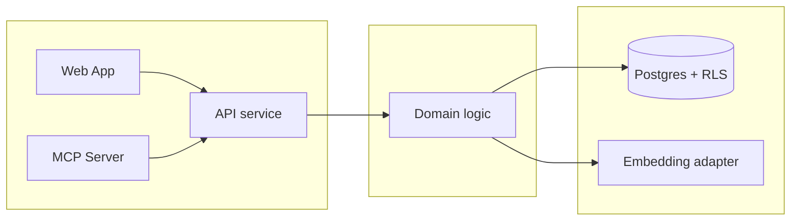

# Canonical Anthara spec skeleton

Use verbatim. Section order is fixed. Read at write time (Step 10 of `SKILL.md`).

````markdown
# Spec: <one-line problem framing>

> Owned by: <author>  ·  Started: <YYYY-MM-DD>  ·  Last revised: <YYYY-MM-DD>  ·  Spec UUID: <uuid>
> Anthara spec — slice-decomposed, categorically-framed. Feeds /anthara:create-ticket and /anthara:develop.

---

## 1. Overview & business context

What, who, why. 3-6 sentences. Ground in the discovery brief if one exists.

## 2. Sources

| ID | Type | Contributor | Date | Description |
|---|---|---|---|---|
| 1 | Anthara Discovery Brief | <name> | <YYYY-MM-DD> | <doc location, short description> |
| 2 | Public docs (host/path) | Web | <fetch date> | <what it documents> |
| 3 | Codebase (this repo) | n/a | <date> | <stack and primary modules> |
| 4 | Org Memory (search_facts: "<query>") | Fabric | <date> | <what it surfaced> |
| 5 | Live spec-writing session with <user> | <user> | <date> | In-session decisions |

## 3. Type ontology

Drawn from corpus language. Categorical, non-overlapping, load-bearing.

### 3.1 Kinds of users
- **<Type>** — <description> [1].

### 3.2 Kinds of data
- **<Type>** — <description, regulated or not> [1].

### 3.3 Kinds of events
- **<Event>** — <when it fires, who triggers> [1].

### 3.4 Kinds of states
- **<State>** — <what it means> [1].

## 4. Invariants

Named, non-trivial, must-always-be-true.

**4.1 <Invariant name>** — <statement>. Sources: [1, 3].

**4.2 <Invariant name>** — <statement>. Sources: [1].

## 5. Slices

Outside-in, independently testable, sequenced for build.

### 5.1 <Verb-led, user-observable slice name>

<One paragraph, outside-in voice. What the user sees and does. Avoid implementation detail.>

- **Touches types:** <list from §3>.
- **Preserves invariants:** <list from §4>.
- **Affected modules** (when in repo): <list>.
- **Active packs:** <list, e.g. HIPAA Security & Privacy, OWASP A01>.

<Inline diagram if the slice has a UI or non-trivial sequence. ASCII for screens, mermaid for sequences and state changes. Skip if prose suffices.>

**Acceptance criteria** (markdown checklist; mark `[x]` as the AC is implemented and verified)

- [ ] **5.1.1** <Functional AC, observable from outside.>
- [ ] **5.1.2** <Compliance AC tied to an active pack rule.>
- [ ] **5.1.3** <Error-path AC.>

### 5.2 <Next slice>
<...>

## 6. NFRs & regulatory compliance

Pack-derived. Each NFR cites the originating pack rule and (where applicable) a regulatory control ID.

### 6.1 <Pack name>

**6.1.1 <NFR statement>** — derived from rule: <rule name>. Cited control: <e.g. HIPAA §164.312(a)(1)>. Sources: [<pack>].

### 6.2 <Pack name>
<...>

### 6.N Control coverage matrix

| Control | Pack | Slices | Evidence committed |
|---|---|---|---|
| HIPAA §164.312(a)(1) | HIPAA Security & Privacy | 5.1, 5.3 | Audit-log entry on every PHI read; covered by AC 5.1.2 and 5.3.2 |

## 7. Architecture

A deliberate structural choice, named and justified.

### 7.1 Tech stack

| Layer | Choice | Rationale |
|---|---|---|
| Backend runtime | <NestJS / Hono / FastAPI / Go / etc.> | <2-3 sentences> |
| Database | <Postgres (Supabase) / MySQL / MongoDB / etc.> | <...> |
| Hosting | <Supabase / Vercel / AWS / GCP / etc.> | <...> |
| Auth | <Supabase Auth / Auth0 / Clerk / etc.> | <...> |
| Other | <vector store, queue, cache, search, etc.> | <...> |

### 7.2 Architectural style

**Style:** *<one of: layered / hexagonal / onion / clean / DDD / event-driven / CQRS / microservices / modular monolith / SOA / pipe-and-filter / actor / space-based / serverless-FaaS / micro-frontends>*.

**Why this style here:** <2-4 sentences justifying the choice from requirements (scale, slice independence, regulated content, async needs) and tech stack (some stacks naturally favor certain styles).>

**Dependency direction:** <e.g., "outer → inner; UI / API depend on application services; application services depend on domain; domain depends on nothing"; or "events flow forward through the bus; producers do not know consumers"; etc.>

**Anti-patterns the style forbids:** <e.g., "no controllers reaching into other controllers", "no shared mutable singletons", "no cross-bounded-context imports without an anti-corruption layer">.

### 7.3 Module decomposition



| Module | Responsibility | Depends on |
|---|---|---|
| `apps/web/` | UI surface | API contract |
| `apps/api/` | HTTP boundary, request validation | domain |
| `domain/` | business rules and invariants | (nothing) |
| `infrastructure/` | DB, external SDKs | (used by domain via ports) |

### 7.4 Data flow (optional)

Include when runtime flow is non-trivial. Mermaid sequence or flow diagram. Reference types from §3 and slices from §5.

### 7.5 Threat model seed (optional)

Adversarial paths, trust boundaries, primary risks. Not full STRIDE; a seed for security review. Mermaid trust-boundary diagram when boundaries are non-obvious.

## 8. Codebase impact map

(When run inside a repo.)

| Module | Slices that touch it | Likely change shape |
|---|---|---|
| `apps/transcripts/` | 5.1, 5.2 | New service + DB migration |

## 9. Open questions

Genuinely external blockers — never lazy unknowns.

**9.1 <Open question>.** Awaiting: <stakeholder / data / review>.

---

## Changelog

- <YYYY-MM-DD> — <author> — Initial spec from discovery brief [1].
````
