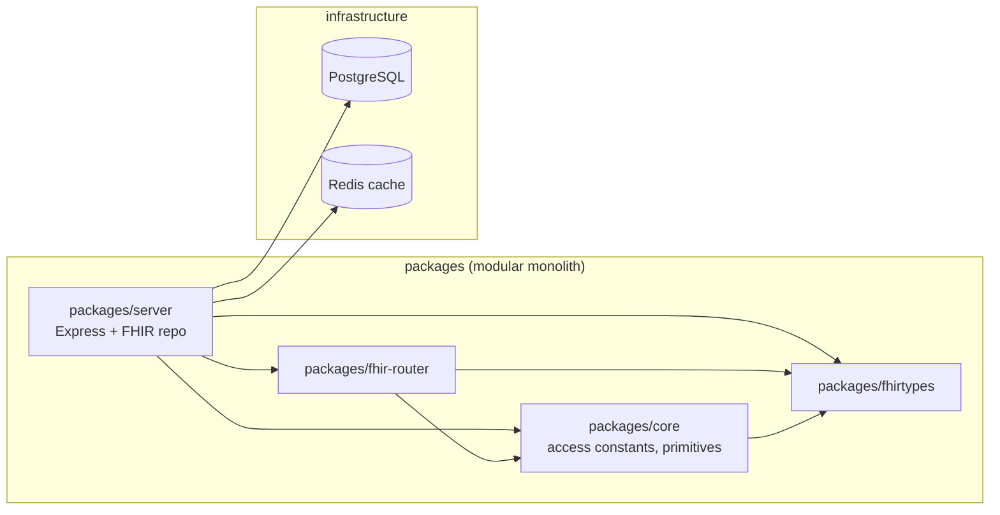
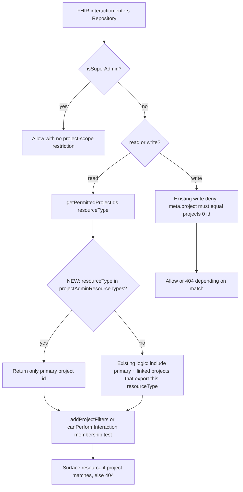

# Spec: Tighten Linked Project visibility — scope project admin resources to their originating project

> Owned by: Chandu Kommineni (chandu@incubyte.co)  ·  Started: 2026-05-19  ·  Last revised: 2026-05-19  ·  Spec UUID: 0dc6e770-6658-4cb3-9ebc-5875494c59b1
> Anthara spec — slice-decomposed, categorically-framed. Feeds /anthara:create-ticket and /anthara:develop.
> Risk: HIGH (authorization change on admin/auth resources in a HIPAA-regulated FHIR substrate).

---

## 1. Overview & business context

`Project.link` was introduced as a narrow mechanism for sharing reference data across Medplum projects — primarily `CodeSystem`, `ValueSet`, `StructureDefinition` profiles, and bots [2]. As adoption has grown, linked projects have become a general-purpose visibility channel: every resource type whose enclosing project is reachable via `Project.link` is exposed to readers of the parent project, subject only to `Project.exportedResourceType` filtering [3, §`getPermittedProjectIds` at `packages/server/src/fhir/repo.ts:1664-1684`]. That includes the seven resource types tagged as `projectAdminResourceTypes` in `packages/core/src/access.ts:21-29` [3] — `Package`, `PackageRelease`, `PackageInstallation`, `Project`, `ProjectMembership`, `User`, `UserSecurityRequest` — three of which (`ProjectMembership`, `User`, `UserSecurityRequest`) carry credentials, password-reset state, and membership/role data whose cross-project visibility is a security regression against HIPAA §164.312(a)(1) access controls and the "minimum necessary" standard [4].

This spec tightens that channel. Admin resources are visible only to readers whose **primary** project is their originating project, never via `Project.link`. Linked projects continue to expose non-admin resources per the existing `exportedResourceType` rules — reference-data sharing is preserved. Super-admins retain cross-project visibility on admin resources (existing pattern; see `repo.ts:2269` `isSuperAdmin()` gate [3]). Project admins retain full read/write access to their own project and read-only access to linked projects — the latter is already enforced at `repo.ts:2285` for writes, but lacks named regression coverage and is locked in as an invariant by this spec.

The change has a clean seam: `Repository.getPermittedProjectIds(resourceType)` was just consolidated in PR #9041 [1] as the single chokepoint feeding both `addProjectFilters` (SQL query construction) and `canPerformInteraction` (post-fetch access checks). The fix is one branch inside that method.

## 2. Sources

| ID | Type | Contributor | Date | Description |
|---|---|---|---|---|
| 1 | Git commit | Matt Long | 2026-04-26 | PR #9041 "Consolidate logic for permitted project IDs" — refactor of `Repository.addProjectFilters` and `canPerformInteraction` in `packages/server/src/fhir/repo.ts` introducing `getPermittedProjectIds()` as the unified seam (commit `2379a963a`). |
| 2 | Codebase docs | Medplum core team | n/a | `packages/docs/docs/access/projects.md` — public documentation of the Project isolation model and the Project Linking feature (use cases: CodeSystem/ValueSet/StructureDefinition/Bots sharing). |
| 3 | Codebase (this repo) | n/a | 2026-05-19 | `anthara-ai/medplum`, TypeScript monorepo. Server in `packages/server`, shared types in `packages/core`. Key files: `packages/server/src/fhir/repo.ts` (Repository class, `getPermittedProjectIds`, `canPerformInteraction`), `packages/server/src/fhir/accesspolicy.ts` (`applyProjectAdminAccessPolicy`), `packages/core/src/access.ts` (`projectAdminResourceTypes`, `protectedResourceTypes`, `readInteractions`), `packages/server/src/fhir/repo.test.ts` (existing linked-project test fixtures around lines 2063-2203). |
| 4 | Fabric `get_standards` for this task | Fabric MCP | 2026-05-19 | Active packs: HIPAA Security & Privacy (org-wide rules: ePHI access control, audit controls, minimum necessary standard, integrity controls, PHI data classification, multi-factor authentication, de-identification), plus repo-specific `anthara-ai/medplum` rules (automated alerting on anomalous security events, quarterly access reviews, unique user identification, monitoring of internal controls, rate limiting, secret scanning, fraud risk assessment). Standards are hard constraints per Anthara policy. |
| 5 | Public web docs | Medplum | 2026-05-19 | https://www.medplum.com/docs/access/projects — Linked Projects section. Confirms "read-only view of all resources in the shared projects" framing and lists CodeSystem/ValueSet/StructureDefinition as the canonical use cases. |
| 6 | Live spec-writing session | Chandu Kommineni | 2026-05-19 | In-session decisions: scope = all 7 `projectAdminResourceTypes`; super-admin bypass preserved; deny shape stays as silent 404 with no new audit log; storage at `docs/specs/linked-project-admin-scoping-spec.md`; slice order 5.1 → 5.4 confirmed. |

## 3. Type ontology

Drawn from the existing Medplum project model and FHIR domain.

### 3.1 Kinds of users

- **Anonymous / non-authenticated caller** — no `RequestContext` projects bound; out of scope for this spec [3].
- **Standard project member** — `ProjectMembership.admin = false`; access governed by `AccessPolicy`. Their `Repository.context.projects[0]` is their primary project; subsequent entries are linked projects exposed via `Project.link` [3, §`addProjectFilters` in `repo.ts`].
- **Project admin** — `ProjectMembership.admin = true`. Receives `applyProjectAdminAccessPolicy` augmentation [3, §`accesspolicy.ts:268`] that grants admin-resource access patterns. Full read/write on own project; read-only on linked projects.
- **Super-admin** — `Project.superAdmin = true`. Bypasses project-scope checks via `isSuperAdmin()` short-circuit at `repo.ts:2269` [3]. Out of scope for the new restriction; this spec preserves the bypass.

### 3.2 Kinds of data

- **Project admin resource** — any of the seven types listed in `packages/core/src/access.ts:21-29` [3]: `Package`, `PackageRelease`, `PackageInstallation`, `Project`, `ProjectMembership`, `User`, `UserSecurityRequest`. The three credential-adjacent ones (`User`, `UserSecurityRequest`, `ProjectMembership`) carry secrets, password-reset state, MFA enrollment, and authorization role data — treated as PHI-adjacent under HIPAA §164.308(a)(4) workforce access management [4].
- **Protected resource** — any of the three types in `protectedResourceTypes` [3, `access.ts:15`]: `DomainConfiguration`, `JsonWebKey`, `Login`. Only super-admins can read or write these. Already isolated; out of scope here.
- **Non-admin (sharable) resource** — every other FHIR resource type. Continues to be shareable across linked projects per `Project.exportedResourceType` [2, 3].

### 3.3 Kinds of events

- **Search interaction** — `AccessPolicyInteraction.SEARCH` (also `READ`, `VREAD`, `HISTORY`); the four members of `readInteractions` in `core/src/access.ts:47-52` [3]. Flows through `Repository.addProjectFilters` (query-time) and `canPerformInteraction` (post-fetch validation).
- **Direct-read interaction** — `READ` and `VREAD` on a specific resource ID. Same enforcement path as search via `canPerformInteraction`; also exercised by the Redis cache path (see regression test at `repo.test.ts:2132-2185` [3]).
- **Write interaction** — `CREATE`, `UPDATE`, `DELETE`. Falls through the `else` branch at `repo.ts:2285` which already blocks any resource whose `meta.project` does not equal `this.context.projects[0].id`.

### 3.4 Kinds of states

- **Repository context with single project** — `this.context.projects.length === 1`; no linked projects; new restriction has no observable effect.
- **Repository context with linked projects** — `this.context.projects.length > 1`; `projects[0]` is the primary, the rest are linked. The new restriction kicks in here: admin resource types collapse to `[projects[0].id]` regardless of `Project.exportedResourceType`.
- **Super-admin context** — `Project.superAdmin = true` somewhere in `context.projects`. `isSuperAdmin()` returns true; the new restriction does not apply.

## 4. Invariants

**4.1 Admin-resource origin invariant.** For every read of a `projectAdminResourceType` resource by a non-super-admin reader, the returned resource's `meta.project` equals `this.context.projects[0].id` (the primary/originating project). Linked-project admin resources never surface. Sources: [3, 6].

**4.2 Non-admin sharing preserved invariant.** For every read of a non-admin resource type, the existing `Project.link` + `Project.exportedResourceType` filtering rules are unchanged. CodeSystem, ValueSet, Organization, Patient (when exported), and every other non-admin type remain visible across linked projects per the pre-existing logic. Sources: [2, 3, 5, 6].

**4.3 Super-admin bypass preserved invariant.** For every interaction where `isSuperAdmin()` returns true, none of the project-scope restrictions in `canPerformInteraction` apply, including the new admin-origin restriction. The `isSuperAdmin()` short-circuit at `repo.ts:2269` is the single gate; this spec adds no new condition above it. Sources: [3, 6].

**4.4 Linked-project write-deny invariant.** For every non-super-admin write (`CREATE`, `UPDATE`, `DELETE`) where the candidate resource's `meta.project` is not equal to `this.context.projects[0].id`, the repository returns no matching policy (currently surfacing as HTTP 404 to the FHIR caller). This is existing behavior at `repo.ts:2285`; this spec pins it under named regression tests. Sources: [3, 6].

**4.5 Single chokepoint invariant.** All project-scope visibility decisions for admin and non-admin resources flow through `Repository.getPermittedProjectIds(resourceType)`. There is no parallel access path that bypasses this method for any FHIR read interaction. Sources: [1, 3].

## 5. Slices

Outside-in, independently testable, sequenced for build. Slice 5.1 is the behavior change; 5.2–5.4 are invariant lockdowns with no behavior change but new named regression tests.

### 5.1 Admin resources stop surfacing through linked projects

A project admin authenticated against Project A, where Project A has `Project.link = [{project: B}]`, issues a search or direct read against any of the seven `projectAdminResourceTypes`. Resources from Project B no longer appear in results; direct reads of a Project B admin resource by ID return HTTP 404. The behavior is uniform across all admin types, regardless of whether Project B sets `exportedResourceType`. The change is implemented as a guard inside `Repository.getPermittedProjectIds(resourceType)` [3, `repo.ts:1663-1684`] that collapses the returned project ID list to `[this.context.projects[0].id]` when the resource type is in `projectAdminResourceTypes`.

- **Touches types:** Project admin resource (§3.2), Project admin (§3.1), Repository context with linked projects (§3.4).
- **Preserves invariants:** 4.1 (introduces it), 4.5.
- **Affected modules:** `packages/server/src/fhir/repo.ts` (single method change); `packages/server/src/fhir/repo.test.ts` (new tests adjacent to the existing `Project.exportedResourceType` tests at line 2063+).
- **Active packs:** HIPAA Security & Privacy (§164.312(a)(1) access control; §164.308(a)(4) minimum necessary; §164.312(b) audit controls — read events on admin resources are already logged through the existing audit path, no new audit-log requirement); repo-specific quarterly-access-review rule (reduces over-broad access surfacing).

```mermaid
sequenceDiagram
    actor Admin as Project Admin (in Project A)
    participant Repo as Repository
    participant DB as Postgres

    Admin->>Repo: search(ProjectMembership)
    Repo->>Repo: getPermittedProjectIds('ProjectMembership')
    Note over Repo: NEW: ProjectMembership is in projectAdminResourceTypes<br/>→ return [A.id] only, ignore Project.link
    Repo->>DB: SELECT ... WHERE projectId IN (A.id)
    DB-->>Repo: rows from Project A only
    Repo-->>Admin: Bundle with Project A members only

    Admin->>Repo: read(User, idOfUserInProjectB)
    Repo->>DB: SELECT WHERE id=...
    DB-->>Repo: row with meta.project = B.id
    Repo->>Repo: canPerformInteraction(read, resource)
    Note over Repo: permittedProjectIds=[A.id]; B.id not in list
    Repo-->>Admin: 404 Not Found
```

**Acceptance criteria** (markdown checklist; mark `[x]` as the AC is implemented and verified)

- [x] **5.1.1** Search interaction: with a `Repository` whose context lists `projects = [A, B]` (B reachable via `Project.link`), `repo.searchResources({ resourceType: 'ProjectMembership' })` returns only memberships whose `meta.project === A.id`; memberships belonging to Project B (created by `linkedRepo`) are excluded from results. Same assertion for `User`, `UserSecurityRequest`, `Package`, `PackageRelease`, `PackageInstallation`. (`Project` is special-cased — see AC 5.1.6.)
- [x] **5.1.2** Direct-read interaction: `repo.readResource('ProjectMembership', idOfMembershipInProjectB)` rejects with `OperationOutcomeError(notFound)`. Same assertion for `User`, `UserSecurityRequest`, `Package`, `PackageRelease`, `PackageInstallation`.
- [x] **5.1.3** `exportedResourceType` cannot widen the restriction: when Project B sets `exportedResourceType: ['ProjectMembership']` (an attempt to deliberately export an admin type), the search and direct-read from Project A still exclude Project B's memberships. The new guard in `getPermittedProjectIds` runs before the `exportedResourceType` check.
- [x] **5.1.4** Compliance (HIPAA §164.308(a)(4) minimum necessary): a unit test asserts that for each of the seven admin resource types, calling `getPermittedProjectIds(resourceType)` on a multi-project `Repository` context returns an array of length exactly 1 containing `context.projects[0].id`. Cited rule: HIPAA "Minimum necessary standard" — `get_standards` rule_id `a4fe47cd-1557-48a1-8f8d-44c2d9c8cbd7` [4].
- [x] **5.1.5** Compliance (HIPAA §164.312(a)(1) access control / server-side authorization): the test deliberately bypasses the query path by warming the Redis cache for a Project B `User` resource (mirroring the cache-path regression test at `repo.test.ts:2132-2185`); the subsequent `repo.readResource('User', cachedId)` from Project A still returns 404. Cited rule: HIPAA "Access control" — `get_standards` rule_id `66c041ee-dff2-492d-a184-67653649c920` [4].
- [x] **5.1.6** `Project` resource carve-out preserved: when searching for `Project` (resourceType === 'Project'), Project A and Project B both appear in results (existing behavior — `getPermittedProjectIds` continues to widen the project list for the `Project` resourceType itself per `repo.ts:1675`). This is the explicit exception in the existing code; the new guard for admin resources does NOT collapse the `Project` carve-out. Equivalent assertion: the existing test `repo.test.ts:2063 'Project.exportedResourceType'` (which asserts `projects.length === 3`) continues to pass unchanged.

### 5.2 Non-admin resource sharing across linked projects unchanged

The three existing tests in `repo.test.ts` covering `Project.exportedResourceType` behavior (`'Project.exportedResourceType'`, `'Project.exportedResourceType enforced on cached reads'`, `'Project.exportedResourceType allows resources in primary project'` at lines 2063, 2132, 2187) continue to pass without modification. No new behavior; this slice exists to make the regression explicit through dedicated assertions plus a parametric sweep across a representative non-admin set.

- **Touches types:** Non-admin (sharable) resource (§3.2), Repository context with linked projects (§3.4).
- **Preserves invariants:** 4.2.
- **Affected modules:** `packages/server/src/fhir/repo.test.ts` (new test cases; no production code changes).
- **Active packs:** HIPAA Security & Privacy (no PHI regression — non-PHI reference data sharing preserved); test-integrity (regression-coverage rule).

**Acceptance criteria**

- [x] **5.2.1** With Project A linking Project B (no `exportedResourceType` set on B), reads from `repo` (A-bound) of `Organization`, `CodeSystem`, `ValueSet`, `Patient`, and `Observation` created in B via `linkedRepo` continue to return the linked resources. (Direct extension of the existing line-2063 test, sweeping the named non-admin types.)
- [x] **5.2.2** With Project A linking Project B with `exportedResourceType: ['Organization']`, a search from `repo` for `Organization` returns Project B's organizations; a search for `Patient` does not return Project B's patients. (Locks in the existing line-2063 behavior verbatim.)
- [x] **5.2.3** The cached-read path for a non-admin exported type (`Organization` in the example fixture) continues to return the linked resource from `repo.readResource` — locks in `repo.test.ts:2132` behavior verbatim.
- [x] **5.2.4** Compliance (test-integrity / repo-specific monitoring rule): a parametric test iterates the seven admin types and a representative non-admin set; for each admin type the search returns 0 linked results; for each non-admin type the search returns the expected linked results given the `exportedResourceType` setting. Single assertion table makes the invariant pair (4.1 + 4.2) legible.

### 5.3 Super-admin retains cross-project admin-resource visibility

A super-admin running searches or direct reads against any of the seven admin resource types continues to see resources from every project in their context, regardless of `Project.link` membership. The `isSuperAdmin()` short-circuit at `repo.ts:2269` is the existing gate; this slice adds a named regression test confirming the new guard introduced in 5.1 is below that gate and never reached for super-admins.

- **Touches types:** Super-admin (§3.1), Project admin resource (§3.2).
- **Preserves invariants:** 4.3, 4.5.
- **Affected modules:** `packages/server/src/fhir/repo.test.ts` (new test case).
- **Active packs:** HIPAA Security & Privacy (super-admin access governed by SuperAdmin role; out of scope for the new restriction); repo-specific "unique user identification" rule (super-admin actions are individually attributed via existing audit log).

**Acceptance criteria**

- [ ] **5.3.1** Construct a super-admin `Repository` context (via `getSystemRepo()` or `superAdmin: true` Project + a `ProjectMembership`); create a `User` and a `ProjectMembership` in Project A and another in Project B (linked or unlinked). Search for `User` and `ProjectMembership` returns resources from both projects. Search for `UserSecurityRequest` returns resources from both projects.
- [ ] **5.3.2** Direct-read of a Project B `User` resource by ID from a super-admin context returns the resource (not 404).
- [ ] **5.3.3** Compliance (HIPAA §164.308(a)(3) workforce security — role-based access control): a test asserts that toggling `isSuperAdmin()` (by swapping the Repository context fixture) flips the admin-resource visibility behavior end-to-end, demonstrating the bypass is exactly the gate.

### 5.4 Project-admin writes against linked-project resources continue to be denied

A project admin attempts `CREATE`/`UPDATE`/`DELETE` on a resource whose `meta.project` is a linked project, not the primary. The existing path at `repo.ts:2285` (`else if (resource.meta?.project !== this.context.projects?.[0]?.id) { return undefined; }`) already denies this — surfacing as HTTP 404 with no audit log. This slice pins the behavior with named regression tests covering all three write interactions, both admin and non-admin types, so a future refactor cannot inadvertently relax the rule. No production code changes.

- **Touches types:** Project admin (§3.1), Repository context with linked projects (§3.4), Project admin resource (§3.2), Non-admin resource (§3.2).
- **Preserves invariants:** 4.4.
- **Affected modules:** `packages/server/src/fhir/repo.test.ts` (new test case).
- **Active packs:** HIPAA Security & Privacy (write-path access control); repo-specific quarterly-access-review rule.

**Acceptance criteria**

- [ ] **5.4.1** A project admin in Project A (with linked Project B exporting `Organization`) attempts `repo.updateResource(...)` on a Project B `Organization` resource (i.e., setting `meta.project` to B.id explicitly, or fetching an existing B-resource and updating it). The call rejects with `OperationOutcomeError(notFound)`.
- [ ] **5.4.2** Same setup as 5.4.1 but for `CREATE`: `repo.createResource({ resourceType: 'Organization', name: 'X', meta: { project: B.id } })` rejects with `OperationOutcomeError(notFound)` (the resource is denied at `canPerformInteraction` before insertion).
- [ ] **5.4.3** Same setup but for `DELETE`: `repo.deleteResource('Organization', linkedOrg.id)` rejects with `OperationOutcomeError(notFound)`.
- [ ] **5.4.4** Each of 5.4.1-5.4.3 repeated with each of the seven `projectAdminResourceTypes` as the target. (Note: `Project` writes may have additional special-casing; the test asserts the deny behavior holds for the resource types reachable in the test harness.)
- [ ] **5.4.5** Compliance (HIPAA §164.312(b) audit controls): verify that no NEW audit log entries are emitted for denied writes (consistent with the existing behavior — denial is a 404, not a 403). Cited rule: HIPAA "Audit controls" — `get_standards` rule_id `2e7ce98c-9655-40ff-9760-7a8043520d1b` [4]. If a future spec changes denial to 403 + audit, this AC documents the current contract.

## 6. NFRs & regulatory compliance

Pack rules retrieved via `get_standards` for `anthara-ai/medplum` with task = "feature, scope project admin resources to originating project only, surface_area=[api, auth, db], data_handled=[phi, credentials, audit_logs]" [4].

### 6.1 HIPAA Security & Privacy (org-wide)

**6.1.1 Server-side authorization is the sole gate.** Derived from rule: "Access control — When you write endpoints that access ePHI, always add server-side authorization checks using role-based access control. Default every route to deny access. Never assume client-side checks are sufficient — always verify permissions server-side before returning any health data." (rule_id `66c041ee-dff2-492d-a184-67653649c920`). Cited control: HIPAA §164.312(a)(1). All new restrictions land inside `Repository` (server-side); no client-side check is introduced. Sources: [4].

**6.1.2 Minimum-necessary scoping for admin resources.** Derived from rule: "Minimum necessary standard — Only include the minimum fields needed for that specific operation." (rule_id `a4fe47cd-1557-48a1-8f8d-44c2d9c8cbd7`). Cited control: HIPAA §164.502(b). The new restriction implements the minimum-necessary principle at the resource-visibility level: admin resources from other projects are not "needed" for operating against a linked project, so they are removed from the surface. Sources: [4].

**6.1.3 Audit controls on admin-resource reads.** Derived from rule: "Audit controls — When you write code that accesses ePHI, always add audit logging that records who accessed what, when, and why. Use structured logging for every ePHI access event. Never log actual PHI data in log entries — log only metadata such as record IDs and operation types." (rule_id `2e7ce98c-9655-40ff-9760-7a8043520d1b`). Cited control: HIPAA §164.312(b). No new audit-log requirement is introduced — existing read events already flow through the repository's audit path; denials surface as 404 with no body, consistent with HIPAA's "no existence disclosure" preference. The decision to not log denied attempts is captured as AC 5.4.5 to document the contract. Sources: [4, 6].

**6.1.4 PHI / credential field classification.** Derived from rule: "PHI data classification — explicitly mark PHI fields using decorators or annotations; maintain a registry of which fields contain PHI." (rule_id `76cf673a-d2b5-4343-a6f6-01e51220ba11`). Cited control: HIPAA §164.514. The seven admin resource types — particularly `User`, `UserSecurityRequest`, and `ProjectMembership` — already have `hiddenFields` declarations in `applyProjectAdminAccessPolicy` at `accesspolicy.ts:300-326` for `passwordHash`, `mfaSecret`, `superAdmin`, etc. [3]. This spec preserves those declarations unchanged. Sources: [3, 4].

**6.1.5 Workforce access management.** Derived from rule: "Enforce unique user identification — prohibit shared accounts." (rule_id `13f29d85-e2c9-4b6d-a324-c4987e2f34aa`, repo-specific). The change reinforces this rule by ensuring that `User` and `ProjectMembership` resources — the carriers of identity information — cannot be enumerated across projects via linked-project context. An admin in Project A cannot learn the membership roster of Project B through `Project.link`. Sources: [4].

### 6.2 Anthara repo-specific (anthara-ai/medplum)

**6.2.1 Quarterly access reviews remain auditable.** Derived from rule: "Perform quarterly access reviews and revoke unnecessary permissions." (rule_id `eac8053f-16c4-4169-af01-20b1222c8298`). Access-review queries — when run by a project admin against `ProjectMembership` — now return precisely the memberships they administer (their own project's), reducing both audit-evidence noise and over-broad access exposure. Sources: [4].

**6.2.2 Anomalous-event alerting on denied admin-resource reads.** Derived from rule: "Implement automated alerting for anomalous security events. Define alerting rules for: failed auth spikes, impossible travel, bulk data exports, privilege escalation, off-hours admin access." (rule_id `519681c1-b17f-454b-9c5e-a43b479c242e`). Out of scope for this spec (no new audit/alerting is introduced — see 6.1.3 decision), but flagged as an §11 open question for follow-up: should a sudden 404 spike on admin resource paths from linked-project contexts trigger an alert? Sources: [4, 6].

**6.2.3 Monitoring effectiveness of the restriction.** Derived from rule: "Perform ongoing monitoring of internal controls. Implement automated monitoring that continuously verifies control effectiveness." (rule_id `48605cd3-8b8a-4b0f-88fa-30a812ddb9a7`). The control's effectiveness is verified continuously by the regression test set in slices 5.2-5.4 running on every CI build. AC 5.2.4 in particular provides a parametric coverage table that doubles as a control-effectiveness assertion. Sources: [4].

### 6.3 Test-integrity (always-on)

**6.3.1 Pyramid bias and reuse over reinvention.** Every AC in §5 is implementable as a unit-level test using the existing `createTestProject`, `getRepoForLogin`, `globalSystemRepo` fixtures already present in `repo.test.ts` (per the pattern at lines 2063-2203 [3]). No new integration-level harness is required. Test placement: extend the existing `describe('Repository', ...)` block, do not create a parallel file.

### 6.N Control coverage matrix

| Control | Pack | Slices | Evidence committed |
|---|---|---|---|
| HIPAA §164.312(a)(1) — Access control | HIPAA Security & Privacy | 5.1, 5.3, 5.4 | Server-side restriction in `getPermittedProjectIds`; super-admin bypass preserved at `repo.ts:2269`; write-deny pinned at `repo.ts:2285`. ACs 5.1.4, 5.1.5, 5.3.3. |
| HIPAA §164.502(b) — Minimum necessary | HIPAA Security & Privacy | 5.1 | Admin resource search/read narrowed to originating project. ACs 5.1.1, 5.1.2, 5.1.3, 5.1.4. |
| HIPAA §164.312(b) — Audit controls | HIPAA Security & Privacy | 5.4 | Existing audit path preserved; no new denial-audit added (documented contract). AC 5.4.5. |
| HIPAA §164.308(a)(3) — Workforce security | HIPAA Security & Privacy | 5.1, 5.3 | `User`/`ProjectMembership` no longer enumerable across linked projects for non-super-admins; super-admin role unchanged. ACs 5.1.1, 5.3.1. |
| HIPAA §164.514 — PHI field classification | HIPAA Security & Privacy | 5.1 (preserved) | Existing `hiddenFields` for `passwordHash`/`mfaSecret`/`superAdmin` in `applyProjectAdminAccessPolicy` left intact. (No new AC — invariant 4.5 covers.) |
| Quarterly access reviews (rule_id `eac8053f-...`) | anthara-ai/medplum | 5.1 | Access-review queries now return scoped results. (Captured in §6.2.1 narrative.) |
| Internal-controls monitoring (rule_id `48605cd3-...`) | anthara-ai/medplum | 5.2, 5.3, 5.4 | Regression test suite encodes the controls; CI run verifies on every build. AC 5.2.4. |

## 7. Architecture

Brownfield. Inheriting from the existing Medplum codebase; no new architectural style introduced.

### 7.1 Tech stack

| Layer | Choice | Rationale |
|---|---|---|
| Backend runtime | Node.js + TypeScript (Express-based FHIR server in `packages/server`) | Existing stack; unchanged by this spec. |
| Database | PostgreSQL | Existing stack; the `addProjectFilters` SQL `WHERE projectId IN (...)` filter targets PostgreSQL directly. |
| FHIR routing | Custom router in `packages/fhir-router` | Existing. Routes feed `Repository` operations, which is where the new restriction lives. |
| Test framework | Vitest at the root; the affected file `repo.test.ts` follows the existing test conventions (see `withTestContext`, `createTestProject` fixtures). | Reuse over reinvention. |
| Auth & access | Multi-layered: `AccessPolicy` (FHIR-level resource policies in `packages/server/src/fhir/accesspolicy.ts`), `Repository.context.projects` array (project-scope visibility in `repo.ts`), `isSuperAdmin()` / `isProjectAdmin()` role gates. | Unchanged. |

### 7.2 Architectural style

**Style:** *modular monolith with layered intra-package structure*.

**Why this style here:** Medplum's codebase is a TypeScript monorepo of independently-publishable packages (`@medplum/server`, `@medplum/core`, `@medplum/fhirtypes`, `@medplum/fhir-router`, etc.) deployed as a single Node.js process [3]. Each package has a layered internal shape — for `packages/server` the layers are roughly `app/auth/routes → fhir/repo → fhir/lookups → database`. Dependencies flow one direction: server depends on core and fhirtypes; core does not depend on server. This is the de-facto style observable in the repo; the spec inherits it verbatim.

**Dependency direction:** `packages/server` depends on `packages/core` (for `projectAdminResourceTypes`, `readInteractions`, access primitives), `packages/fhirtypes` (for `Project`, `ProjectMembership`, `User`, `UserSecurityRequest` TypeScript shapes), and `packages/fhir-router`. Core depends on `packages/fhirtypes` only. There is no path from core or fhirtypes back into server. The new admin-scope guard lives in `packages/server/src/fhir/repo.ts` and reads from `projectAdminResourceTypes` exported by `packages/core/src/access.ts` — i.e., the access-control vocabulary stays in `core`, the enforcement stays in `server`.

**Anti-patterns the style forbids:** No cross-package imports against the dependency direction (server-only logic must not leak into core). No parallel enforcement paths (all project-scope visibility goes through `Repository.getPermittedProjectIds`; do not bypass via raw SQL or alternative repo wrappers). No bespoke admin-resource lists scattered across files (single source of truth is `projectAdminResourceTypes` in `packages/core/src/access.ts`).

### 7.3 Module decomposition



| Module | Responsibility | Depends on |
|---|---|---|
| `packages/server/src/fhir/repo.ts` | `Repository` class — single enforcement point for project-scope visibility. The new admin-resource guard goes inside `getPermittedProjectIds`. | `core`, `fhirtypes`, Postgres, Redis |
| `packages/server/src/fhir/accesspolicy.ts` | `AccessPolicy` materialization; `applyProjectAdminAccessPolicy` already encodes admin-resource hidden/readonly field policies. Unchanged by this spec. | `core`, `fhirtypes` |
| `packages/core/src/access.ts` | Source of truth for `projectAdminResourceTypes`, `protectedResourceTypes`, `readInteractions`. Unchanged by this spec. | `fhirtypes` |
| `packages/server/src/fhir/repo.test.ts` | Repository unit tests; existing `Project.exportedResourceType` fixtures (lines 2063-2203) are the template for the new slice tests. | (test-time deps) |

### 7.4 Data flow

The single enforcement path. Both the query-time filter and the post-fetch check go through `getPermittedProjectIds`, so a single change in that method covers both code paths.



### 7.5 Threat model seed

Trust boundaries and adversarial paths:

- **Tenant boundary.** Each Medplum `Project` is a tenant. `Project.link` deliberately punches a one-way hole for reference-data sharing. The current threat is that the hole is wider than intended — admin resources cross it. This spec narrows the hole to exclude admin resources.
- **Adversary model.** A project admin in Project A who has been linked to Project B by a super-admin should not be able to enumerate B's users, memberships, or pending password resets. Pre-fix, they can do this via search and direct-read. Post-fix, they cannot.
- **Risk of bypassing the chokepoint.** The single chokepoint design (invariant 4.5) is the security property; a future contributor adding a new SQL path or repository wrapper that constructs its own project-filter logic would silently regress this restriction. Mitigated by: (a) the test suite in slice 5.2-5.4 covering both query and cache paths, (b) the existing cache-bypass regression test at `repo.test.ts:2132` as a template, (c) the architecture invariant 4.5 documented here as a future-review signal.
- **Out of scope for this spec but adjacent.** Bulk export operations (`packages/server/src/fhir/operations/export.ts`) — verified to consult `protectedResourceTypes` but should be re-examined for `projectAdminResourceTypes` handling under linked-project contexts. Flagged as §9.2.

## 8. Codebase impact map

| Module | Slices that touch it | Likely change shape |
|---|---|---|
| `packages/server/src/fhir/repo.ts` | 5.1 only | One-method change: add a guard at the top of `getPermittedProjectIds` (after the `!this.context.projects?.length` early return) that returns `[this.context.projects[0].id]` when `projectAdminResourceTypes.includes(resourceType)`. ~5 lines of code. |
| `packages/server/src/fhir/repo.test.ts` | 5.1, 5.2, 5.3, 5.4 | New tests added adjacent to existing `Project.exportedResourceType` tests at line 2063+. Reuse `createTestProject({ withRepo: true })`, `getRepoForLogin`, `globalSystemRepo` fixtures verbatim. Each slice contributes one or two new `test('...', () => withTestContext(...))` blocks. |
| `packages/core/src/access.ts` | (referenced, not changed) | `projectAdminResourceTypes` is the source of truth; the new guard imports it from `@medplum/core`. No change to the array contents. |
| `packages/server/src/fhir/accesspolicy.ts` | (referenced, not changed) | `applyProjectAdminAccessPolicy` already declares hidden/readonly fields on admin resources — preserved verbatim. |
| `packages/docs/docs/access/projects.md` | optional (5.1) | Documentation note (not strictly required for spec completion; flag as a follow-up) explaining that admin resources do not surface across `Project.link`. |

## 9. Open questions

Genuinely external blockers, deferred or out of scope by design.

**9.1 Anomaly-detection follow-up.** The repo-specific rule `519681c1-...` ("automated alerting for anomalous security events") suggests adding an alert path for cross-project admin-resource access attempts. The current spec keeps deny shape as silent 404 with no new audit log (per the in-session decision in [6]). Should a follow-up spec introduce telemetry on the new code path — counting how often admin-resource requests are filtered out by the new guard — so operations can see whether the restriction is doing anything in production? Awaiting: telemetry / observability owner.

**9.2 Bulk export operations.** `packages/server/src/fhir/operations/export.ts` is the bulk-export path; it consults `protectedResourceTypes` but its handling of `projectAdminResourceTypes` under a linked-project context has not been audited as part of this spec. Awaiting: a dedicated review of export.ts or an explicit decision to treat it as out of scope. Confirm whether bulk export is even reachable for project admins on linked projects in current deployments.

**9.3 Documentation update.** Should `packages/docs/docs/access/projects.md` be updated in this spec or a follow-up? The Linked Projects section currently says "Users of those target projects get a read-only view of all resources in the shared projects" [2] — true for non-admin resources, but admin resources are now excluded entirely. Awaiting: docs owner.

**9.4 Upstream contribution.** This is a security-tightening change in `anthara-ai/medplum` (fork). Is the intent to upstream this to `medplum/medplum`? If yes, that informs how the change is structured (the more surgical, the more likely it lands cleanly upstream). Awaiting: confirmation from Chandu / Anthara fork-management policy.

---

## Changelog

- 2026-05-19 — Chandu Kommineni — Initial spec from /anthara:start → /anthara:spec-writer. PR #9041 [1] identified as the consolidation seam; scope confirmed as all 7 `projectAdminResourceTypes` (not just the 3 named in the original ask); slice order 5.1 → 5.4 confirmed; storage in `docs/specs/`; risk HIGH.
